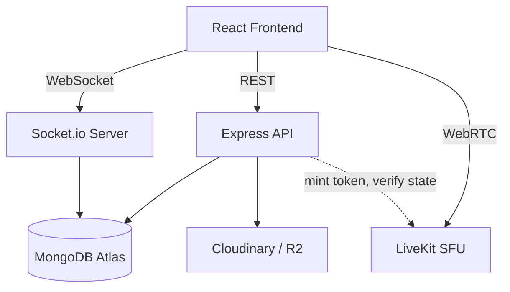
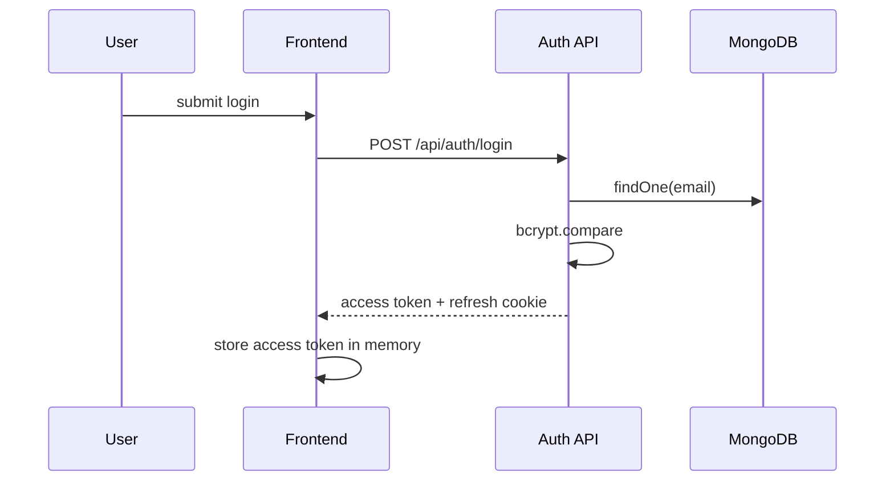
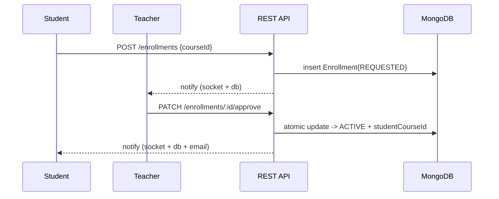
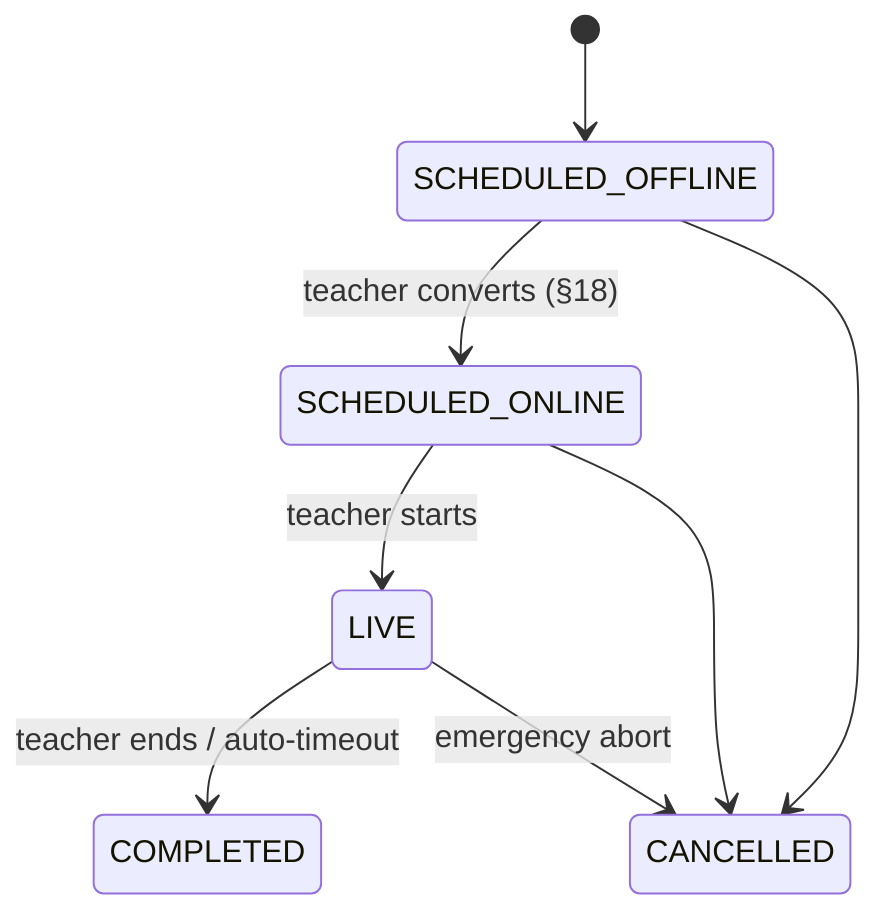
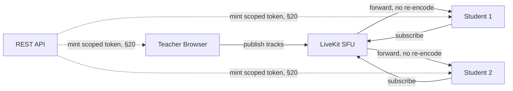
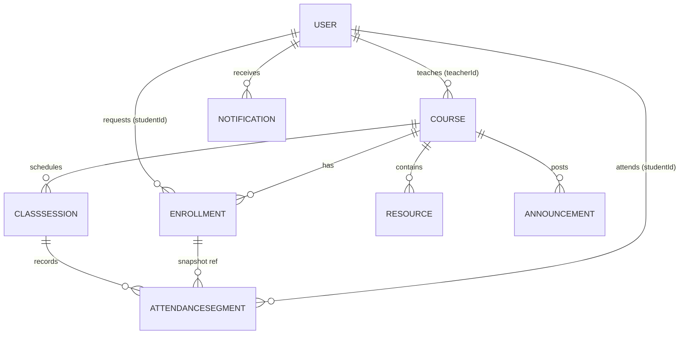
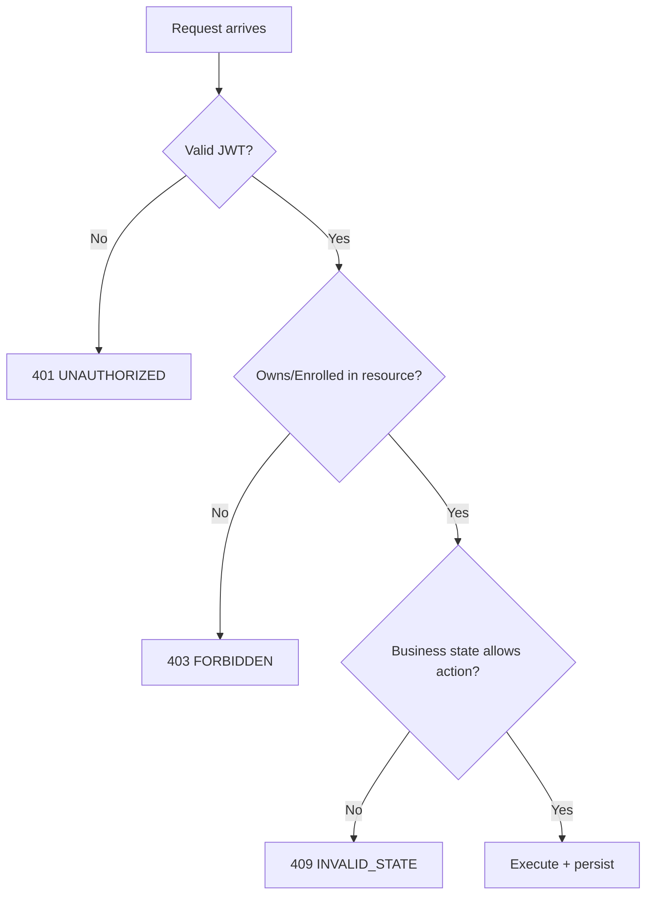

# TeacherConnect — System Study & Engineering Design Document
## Part 5 of 5: Operations, Roadmap, Diagrams, Threat Model, Glossary, Master Blueprint

> Final part. Continues from Part 4. Ends with the master blueprint tying all five parts together.

---

## 36. Audit Logging

**Log these** (write-once, `auditLogs` collection from §9.10):

| Event | actorId | targetType/Id | metadata |
|---|---|---|---|
| Enrollment approved/rejected | teacher | Enrollment | courseId |
| Enrollment removed/withdrawn | teacher or student | Enrollment | reason if any |
| Course created/archived | teacher | Course | — |
| Class session mode changed | teacher | ClassSession | old/new mode |
| Class started/ended/cancelled | teacher | ClassSession | — |
| Participant removed from live room | teacher | ClassSession | targetStudentId |
| Resource uploaded/deleted | teacher | Resource | — |
| Attendance manually corrected | teacher | AttendanceSegment | before/after values |

**Don't log**: passwords (obviously), full JWTs, raw request/response bodies wholesale, chat message contents (a moderation feature is different from an audit log — don't conflate "who removed whom" accountability with "surveil all chat," which is a privacy overreach for what this log is for). Keep `metadata` minimal and purposeful — the goal is "who did what to what, when," not a general-purpose activity dump.

---

## 37. Scalability

| Class size | What holds up as-is | What needs attention |
|---|---|---|
| ≤10 | Everything — REST, sockets, SFU all trivial at this scale | Nothing |
| ≤50 (your MVP target) | LiveKit SFU handles this comfortably; MongoDB Atlas free/shared tier fine; single Node instance fine | Watch Socket.io connection count if many courses are simultaneously live on one server instance |
| ≤100 | Still SFU-appropriate | Consider LiveKit's own scaling (it horizontally scales SFU nodes independently of your app server — this is one of the real advantages of not hand-rolling mediasoup); your Node API server may need to move off a single free-tier instance; MongoDB indexes (§11) start actually mattering for query latency, not just correctness |
| 500+ | Architecture still conceptually holds (SFU + REST + sockets) | This is genuinely a different scale of operational problem: multiple Node instances behind a load balancer need a **Socket.io adapter** (Redis pub/sub adapter) so broadcasts reach clients connected to *any* instance, not just the one that handled the emitting request; LiveKit self-hosted cluster or LiveKit Cloud's higher tiers; notification fan-out moves from synchronous fire-and-forget to a real queue (BullMQ/SQS) |

**The honest scaling story**: nothing in this design needs to be rearchitected to go from 10→100 — it needs *more resources* and *tuned indexes*, which is the right kind of scaling problem to have. The one genuine architectural addition at real scale is the Socket.io Redis adapter, and that's a well-known, drop-in pattern, not a redesign.

---

## 38. Performance

- **Pagination**: every list endpoint (roster, class list, notifications, resources) takes `page`/`limit` or cursor params — never return an unbounded array, even if "it's probably small" today.
- **Indexing**: already covered exhaustively (§11) — this is genuinely most of your performance work for a CRUD-heavy app like this.
- **Caching**: **don't introduce Redis for caching in MVP.** Your read patterns (course lists, rosters) are not hit frequently enough at MVP scale to justify cache-invalidation complexity. Redis becomes genuinely useful the moment you need (a) the Socket.io multi-instance adapter (§37, a structural need, not a caching optimization) or (b) a demonstrably hot read path causing real DB load — profile first, add Redis when a specific number justifies it, not preemptively.
- **WebSocket efficiency**: scope broadcasts to the smallest correct room (`course:X`, not global) — already the design in §21.
- **File delivery**: offloaded entirely to the storage provider's CDN (Cloudinary/R2 both front their assets with a CDN) — your app server never proxies file bytes.

---

## 39. Observability

- **Structured logging**: JSON logs with `requestId`, `userId`, `route`, `status`, `durationMs` for every API call (§29); a `requestId` generated per-request and threaded through to any socket events triggered by that request makes tracing "what caused this notification" possible later.
- **Error logging**: every caught error in the centralized handler logged with stack trace server-side (never sent to client, §26/§27).
- **Health check**: `GET /api/health` — checks DB connectivity, returns 200/503 — this is what your hosting platform's uptime monitor should hit.
- **Live session monitoring**: log LiveKit webhook events (room started, participant joined/left, room ended) server-side even though most of this also flows into `attendance` — the raw log is your debugging trail if attendance numbers ever look wrong.
- **What to actually watch in production, day one**: error rate on the auth endpoints, 5xx rate overall, and LiveKit token-mint failure rate. Everything else (full APM, tracing infra) is a "add when it hurts" investment, not a launch requirement.

---

## 40 & 41. Testing Strategy + API Testing

### Test matrix

| Layer | What to test | Priority |
|---|---|---|
| Unit | Service functions in isolation (enrollmentService.approve, attendance duration calculation) | High |
| Integration | Controller→service→DB for each endpoint, using a test DB (mongodb-memory-server) | High |
| Authorization | **Explicitly test every IDOR scenario from §27.1** — e.g., "teacher B cannot approve enrollment in teacher A's course" as a real test case, not just a code review note | Highest — this is where security bugs actually get caught |
| Socket | Connection auth rejection for bad tokens, room-scoped broadcast correctness | Medium |
| Live classroom | Manual/exploratory for MVP (automating real WebRTC connections is a significant undertaking on its own) — but *do* automate the token-minting authorization logic (§20 steps 2-4), since that's plain REST logic even though the media itself isn't easily unit-testable | Medium |
| Frontend | Component rendering + key interaction flows (React Testing Library) | Medium |
| E2E | One or two critical-path Cypress/Playwright flows: full enrollment→approval→class→join happy path | Medium, do this once things stabilize, not first |

### Example Postman-style test cases

```
POST /api/enrollments
Headers: Authorization: Bearer <studentToken>
Body: { "courseId": "64f..." }
Expect: 201, body.data.status === "REQUESTED"

POST /api/enrollments   (same student, same course, again)
Expect: 409, body.code === "ALREADY_ENROLLED_OR_PENDING"

PATCH /api/enrollments/:id/approve
Headers: Authorization: Bearer <wrongTeacherToken>   (doesn't own the course)
Expect: 403, body.code === "FORBIDDEN"

POST /api/live/:sessionId/token
Headers: Authorization: Bearer <studentTokenNotEnrolled>
Expect: 403, body.code === "FORBIDDEN"
(and critically: assert no `token` field is present anywhere in the response)
```

---

## 42. Development Roadmap

| Phase | Build | Prerequisite | Test by | Don't build yet |
|---|---|---|---|---|
| 0 | Repo setup, env config, folder structure (§30/§31), MongoDB Atlas connection | — | `npm run dev` boots, DB connects | Any feature code |
| 1 | `User` model, `/api/auth` (register/login/refresh/logout), password hashing, JWT middleware | Phase 0 | Postman: register→login→access a dummy protected route | Course/enrollment anything |
| 2 | `Course` model + CRUD, ownership middleware | Phase 1 | Teacher creates/edits/lists own courses; student sees public list only | Enrollment |
| 3 | `Enrollment` model, request/approve/reject, partial-unique index, Student ID generation (§16/§33.1) | Phase 2 | Full request→approve flow via Postman, including the duplicate-request 409 test | Class sessions |
| 4 | `ClassSession` model, CRUD, state machine (§6.3) | Phase 3 | Teacher schedules an offline class | Live/online anything |
| 5 | Offline→Online transition (§18) — REST-only, no real SFU yet, just the state change + notification stub | Phase 4 | Postman-test idempotency (double-call returns 409/ok cleanly) | Actual video |
| 6 | Socket.io wiring — auth, rooms, `class:online`/`class:started`/`class:ended` events | Phase 5 | Two browser tabs, one teacher one student, see live state updates without refresh | Chat, video |
| 7 | LiveKit integration — token minting (§20), basic React video component | Phase 6 | Two real browsers join a room and see/hear each other | Attendance yet |
| 8 | Attendance (§22) — join/leave segment recording tied to LiveKit webhooks/socket events | Phase 7 | Join, disconnect, rejoin — verify segments in DB sum correctly | Resources |
| 9 | Resources (upload/download, §24/§28) | Phase 2 (courses) — can build in parallel with 4-8 | Teacher uploads a PDF, only enrolled student can download it, unenrolled gets 403 | Announcements |
| 10 | Announcements + Notifications (§23) | Phases 3, 6 | Teacher posts announcement, enrolled student gets socket + DB notification | Polish |
| 11 | Security hardening pass — re-audit every endpoint against §27.1's IDOR checklist explicitly, add rate limiting, Helmet, CORS lockdown | After core features work | Run the authorization test matrix from §40 | — |
| 12 | Testing — fill out the automated test suite from §40 for everything built so far | Phase 11 | CI green | — |
| 13 | Deployment — Vercel (frontend), Render/Railway (backend), Atlas (already there), LiveKit Cloud | Phase 12 | Full flow works end-to-end in production, not just localhost | — |

**Why this order specifically**: auth before anything (nothing else can be authorized without it); course before enrollment (enrollment needs something to enroll in); enrollment before class sessions (the trust chain from §1.2 is linear, and building session/live features before enrollment exists would mean building authorization checks against a membership system that doesn't exist yet); REST-only offline→online *before* wiring real video (validates the state-machine/idempotency logic in isolation, cheaply, before adding WebRTC's much higher debugging complexity on top); sockets before LiveKit (get the "notify students something changed" pipe working with simple events before layering media on top — isolates two different failure domains); resources can genuinely be built in parallel with the live-classroom track since it only depends on courses/enrollment, not on class sessions.

---

## 43. Implementation Order (concrete build sequence within each phase)

For any given phase: **model → validator → service → controller → route → (frontend: service → hook → page/component) → socket handler if applicable.** This order matters because each layer's tests depend on the layer below existing — you can't meaningfully write a service-layer test without the model, and there's no point wiring a frontend page to an endpoint that doesn't exist yet, so build strictly bottom-up within each vertical slice (e.g., "enrollment approval" end-to-end) rather than horizontally (e.g., "all models first, then all controllers") — horizontal-first means you don't get a working, testable feature until nearly everything is done, which is demoralizing and hides integration bugs until late.

---

## 44. MVP Definition

**Must have**: everything in Roadmap Phases 0–10 (Parts §1's core loop end-to-end: teacher→course→enrollment→approval→identity→scheduled offline class→switch online→notify→secure join→live class→attendance).

**Should have**: resource download signed-URL security (§24/§28) done properly, not shortcut; basic email notifications for approval/rejection; teacher manual attendance correction.

**Nice to have**: in-room chat (§FR-17) — real value, but the system is fully demonstrable without it; announcement read-receipts; notification preferences.

**Future** (§45 expands): recording, assignments/quizzes, mobile app, multi-teacher courses, admin/institution tier, payments.

**Guardrail**: if you find yourself building anything from "Future" before "Must have" is fully working end-to-end, stop — that's the overengineering trap from §50.

---

## 45. Future Features — architectural fit

| Feature | Fits current architecture as-is? | Notes |
|---|---|---|
| Mobile app | Yes | Same REST/socket API, new client — no backend redesign |
| Push notifications | Mostly | Add FCM/APNs tokens to `User`, extend the notification fan-out (§33.9) with a third channel alongside socket/email |
| Class recording | Partially | LiveKit supports server-side recording — mostly a config + storage-destination addition, not a redesign; adds a new `Resource`-like entity for recordings |
| Assignments/quizzes | Yes, additively | New collections + endpoints following the exact same ownership/membership authorization pattern already established — no changes to existing modules |
| AI teaching assistant / AI notes | Yes, additively | A new service that reads existing data (resources, chat) and writes new derived content — doesn't require touching the trust/authorization model at all |
| Analytics dashboard | Yes | Read-only aggregation queries over existing collections |
| Parent accounts | **Requires a real design decision** | New relationship type (parent↔student) and a new permission tier — not a trivial bolt-on, deserves its own mini version of §4/§15 when you get there |
| Multiple teachers per course | **Requires schema change** | `Course.teacherId` (singular) would need to become a `teacherIds` array or a separate `CourseTeacher` join collection, plus every ownership check in this document (`course.teacherId === req.user.id`) would need to become a membership check instead — a real migration, not additive |
| Institution/admin dashboard | **Requires the Admin role designed properly** | Deferred by design (§4) — don't guess at this now |
| Payments/subscriptions | Additive, but security-sensitive | New collections, third-party integration (Stripe), doesn't touch existing trust model but needs its own careful auth review |
| Certificates | Yes, additively | Generated from existing attendance/completion data |

---

## 46 & 47. System Diagrams

### High-level architecture


### Authentication flow


### Enrollment flow


### Offline → Online transition


### Live classroom architecture


### Database ER diagram


**Relationship explanations**: every arrow above is a **reference**, per the decisions in §10 — none of these are embedded, because every one is 1:many and independently queried (a course's enrollment list, a student's cross-course enrollment list, a session's attendance roster, and a student's cross-session attendance history are all real, separately-hit query patterns).

### Authorization flow


---

## 48. Security Threat Model

| Asset | Threat | Vector | Impact | Probability | Mitigation |
|---|---|---|---|---|---|
| Student/teacher accounts | Credential stuffing | Reused passwords from other breaches | Account takeover | Medium | Rate limiting, bcrypt, encourage unique passwords (can't force it, but don't discourage strong ones with silly complexity rules — see §25) |
| Course data | IDOR — cross-course data access | Modified URL params | Confidentiality breach, competitive/privacy concern between teachers | Medium-high if not carefully implemented | §27.1's per-endpoint checklist |
| Live room | Unauthorized join | Leaked/guessed room link | A stranger in a classroom with minors or sensitive discussion — reputationally severe even if rare | Low (given the token model) but high-impact if the mitigation is ever skipped | §20's independent double-gate |
| Attendance records | Manipulation (fake presence) | Client-side spoofing of join/leave events | Grade/credit integrity | Medium | Server-derived timestamps only, never trust client-submitted timing (§22) — join/leave should be inferred from LiveKit webhook events, not a client `POST` claiming "I joined at X," wherever feasible |
| Learning resources | Unauthorized redistribution | A legitimate student downloads and shares outside the platform | Content leakage | Medium, largely unpreventable by any web app (can't stop a screenshot) | Out of scope technically — a policy/ToS matter, not an engineering one; don't over-invest in DRM for an education MVP |
| Personal information (emails, names) | Data exposure via a misconfigured endpoint | An endpoint returning full `User` documents instead of a projected subset | Privacy breach | Medium if not disciplined | Always project explicit safe fields in any endpoint returning user data to another user (never `.find()` and return the raw document, which would include `passwordHash`, `refreshTokenVersion`, etc.) |

---

## 49. Business Logic vs. Technical Logic — the recap that matters most

| Business rule (what, in plain language) | Technical implementation (how, in code terms) |
|---|---|
| Only approved students can attend a course | Backend requires an `Enrollment` document with `status: 'ACTIVE'` before returning course content or issuing a live-room token |
| A teacher only controls their own courses | Every course/session mutation compares `resource.teacherId === req.user.id`, sourced from the verified JWT, never from the request body |
| A class can move from offline to online, not back | The `mode` field transition is enforced one-directionally in the service layer's allowed-transition check, independent of what the client requests |
| Attendance reflects actual time present | Segments summed from server-recorded join/leave events, not a client-submitted "I attended" flag |

Keep asking yourself this question — "is this a business rule I'm encoding, or an implementation detail?" — throughout development. It's the habit that prevents both under-engineering (forgetting to enforce a rule server-side because "the UI already prevents it") and over-engineering (building elaborate technical infrastructure for a business rule that doesn't actually exist yet).

---

## 50. Common Design Mistakes

- **Trusting frontend authorization** — hiding a button isn't a security control (§15/§27.1).
- **Using Student ID as a password** — directly contradicts §16's entire analysis; conflating a visible label with a secret is the single most consequential mistake this document exists to prevent.
- **Exposing room IDs before authorization** — returning a room name/URL to anyone who merely *asks*, rather than only after the full check chain in §20.
- **"Anyone with the URL can join"** — the anti-pattern §20 is built to structurally prevent, not just discourage.
- **Storing passwords with anything other than bcrypt** (or reversible encryption instead of one-way hashing) — never roll your own.
- **Storing JWTs in localStorage** — readable by any injected script (XSS); use httpOnly cookies for the refresh token at minimum (§14).
- **No membership verification on data-access endpoints** — the root cause of most IDOR bugs (§27.1).
- **No server-side validation, relying on frontend form validation alone** — client validation is a UX nicety, never a security boundary.
- **No explicit state machine** — allowing ad-hoc status strings without an enforced transition table leads to "impossible" states in production that nobody accounted for (this is exactly why §6 exists as its own section, not folded into "misc fields").
- **Direct, ungated database access scattered through controllers** — makes it easy to forget an authorization check in one of many places; the service-layer discipline in §13 exists specifically to centralize where these checks live.
- **No indexes**, discovered only when the roster query takes 4 seconds at 200 students — §11 exists so this is decided upfront, not discovered in production.
- **Poor attendance handling** — a naive single join/leave pair silently produces wrong numbers the first time any student's connection blips (§22).
- **Ignoring reconnects** — building the happy path only, then having the whole live-classroom feature feel broken the first time it's demoed on real wifi.
- **Building video before authentication/authorization** — a natural temptation because video is the "exciting" part, but it means you build your most complex subsystem on top of an access-control foundation that doesn't exist yet, guaranteeing a costly retrofit. The roadmap in §42 deliberately sequences auth first for exactly this reason.
- **Overengineering too early** — introducing Redis, microservices, GraphQL, or a repository-pattern abstraction layer before any concrete problem demands them (§13, §38). Every "don't do this yet" note in this document is here because it's a real trap for a solo dev with the skill to build it but not yet the need.

---

## 51. Design Decision Records

| Decision | Options considered | Chosen | Why | Migration path if wrong |
|---|---|---|---|---|
| Auth model | JWT vs. sessions | JWT (access+refresh) | Stateless, works naturally across REST/socket/SFU boundaries (§14) | Could migrate to session+Redis store later; would touch auth middleware only, not business logic |
| Live video | P2P WebRTC vs. mediasoup vs. LiveKit | LiveKit | Best ratio of real WebRTC learning to solo-dev implementation cost, given the differentiator is authorization, not media transport (§19.5) | Application-level abstraction (a `liveRoomService`) means swapping to mediasoup later touches one service module, not the whole app |
| File storage | Cloudinary vs. S3 vs. R2 | Cloudinary (images) + R2 (documents) | Egress-cost fit for download-heavy resource use case (§28) | Both are swappable behind a `storageService` interface if pricing/needs change |
| Enrollment→Attendance linkage | Embed vs. reference | Reference (`enrollmentId` snapshot on segment) | Independent query patterns on both sides, unbounded growth (§10) | N/A — this is the standard-correct choice, unlikely to need revisiting |
| Student ID design | Global vs. course-scoped vs. hybrid | Hybrid: global `userId` + per-enrollment `studentCourseId` (Option C) | Only model that cleanly supports multi-course membership without conflating identity and credential (§16) | N/A — foundational decision, expensive to change later, get it right now |
| Course membership model | One-to-one course ownership vs. multi-teacher | Single `teacherId` | Matches confirmed MVP scope; multi-teacher explicitly deferred (§45) | Documented as a real schema migration, not a toggle — plan for it if you know multi-teacher is coming, don't half-build it now |
| Socket.io architecture | Custom rooms vs. namespaces per role | Rooms scoped by `course:X` / `user:X` | Simpler mental model, sufficient granularity for MVP's broadcast patterns (§21) | Namespaces could be added later for stronger isolation if needed, additive not breaking |
| Service layer | Controllers direct-to-Mongoose vs. full service layer everywhere | Service layer for multi-step/multi-write operations only (§13) | Balances testability against unnecessary ceremony for a solo dev | Can be tightened to "always use a service" later without restructuring, just moving code |

---

## 52. Glossary

- **Authentication**: proving *who* you are (login).
- **Authorization**: determining *what* an authenticated identity is allowed to do to a specific resource, right now.
- **RBAC**: Role-Based Access Control — permissions derived from a coarse role (`teacher`/`student`); this project layers *resource-level* authorization (ownership/membership) on top, since role alone isn't sufficient here (§15).
- **JWT**: JSON Web Token — a signed, self-contained token asserting claims (like `userId`, `role`) that a server can verify without a database lookup, used here for both access and refresh tokens (§14).
- **Refresh token**: a long-lived credential used only to obtain new short-lived access tokens, stored more restrictively (httpOnly cookie) because it's higher-value if stolen.
- **HTTP-only cookie**: a cookie inaccessible to JavaScript, mitigating XSS-based token theft — used here for the refresh token.
- **WebRTC**: the browser standard/API for real-time peer-to-peer audio/video/data, underlying all live-classroom media in this system (§19).
- **STUN / TURN / ICE / SDP**: the NAT-traversal and negotiation building blocks of WebRTC connections (§19.1) — STUN discovers your public address, TURN relays media when direct connection fails, ICE is the overall candidate-gathering process, SDP is the format used to describe/negotiate a session.
- **SFU**: Selective Forwarding Unit — a media server that receives one upload stream per participant and forwards copies, avoiding the P2P mesh bandwidth explosion (§19.3); this project uses LiveKit, an SFU implementation.
- **Signaling**: the out-of-band exchange of connection metadata (SDP, ICE candidates) needed before media can flow — handled here via Socket.io/LiveKit's own signaling, not raw media transport itself.
- **Socket.io**: a WebSocket-based library used here purely for realtime *notification/state* fan-out (§21) — explicitly not for media.
- **Room** (two distinct meanings in this project, easy to conflate — see §21): a Socket.io room (server-side broadcast grouping) vs. a LiveKit/SFU room (an actual media session).
- **Enrollment**: the join-entity representing a student's request/membership status in a specific course (§9.4), the core trust artifact of the whole system.
- **Session** (also two meanings): a `ClassSession` document (a scheduled class occurrence) vs. an authentication session concept (not separately modeled here since this project uses JWTs, not server-side sessions) — always disambiguate in your own code comments.
- **Idempotency**: a property where performing the same operation multiple times has the same effect as performing it once — the design goal behind every atomic-filtered update in this document (§18, §33, §34).
- **Race condition**: a bug where the correctness of an operation depends on the unpredictable timing/ordering of concurrent operations — addressed throughout via atomic, state-filtered database operations rather than explicit locks (§34).
- **Transaction**: a MongoDB mechanism for atomically applying changes across *multiple* documents/collections — deliberately avoided in this design wherever a single-document atomic update suffices (§34), reserved for genuine multi-document-atomicity needs if you encounter one.
- **Index / compound index**: a database structure that speeds up queries matching indexed fields; a compound index covers queries filtering/sorting on multiple fields together, in a specific field order (§11).
- **Rate limiting**: capping how many requests a client can make in a time window, to blunt brute-force and abuse (§27.2, §29).
- **IDOR**: Insecure Direct Object Reference — accessing another user's data by manipulating an ID the client controls, without server-side ownership verification; the highest-priority vulnerability class in this project (§27.1).
- **CSRF**: Cross-Site Request Forgery — tricking a logged-in user's browser into making an unwanted authenticated request; mitigated here via `SameSite` cookies (§14).
- **XSS**: Cross-Site Scripting — injecting malicious script into content rendered to other users; mitigated via input sanitization and output encoding (§25, §27.2).

---

## 53–56. (Teaching style, code-avoidance, challenge-my-design, and assumptions)

These four instructions from your prompt were applied *throughout* this document rather than as separate sections — every major decision above includes the what/why/how/when/failure-mode/testing structure you asked for, every technical claim was explained rather than asserted, and every place your original spec had a gap or a questionable assumption was flagged explicitly with a chosen recommendation and the reasoning behind it, rather than silently filled in. For completeness, here's the full assumptions ledger gathered from across all five parts:

| ID | Assumption | Why needed | Alternative |
|---|---|---|---|
| A1 | Max classroom size ~50 for MVP | Drives the SFU-not-P2P and single-Node-instance decisions | Confirm your real expected class sizes; if consistently <15, P2P becomes a legitimate (simpler) alternative worth reconsidering |
| A2 | Withdrawn students keep access to already-downloaded resources but not future ones | No confirmed policy given | Could instead revoke all access immediately, or grant a grace period — pick consciously |
| A3 | No Admin role in MVP | Not specified as required now | Add if you anticipate institutional/multi-tenant needs soon — cheaper to design in now than retrofit |
| A4 | One account = one role, permanently | Simplifies auth model significantly | Support dual-role accounts if you have real users needing both — bigger change than it first appears (§9.2) |
| A5 | No explicit "course completed" mass-transition for enrollments | Not specified | Add a `COMPLETED` enrollment status + a teacher-triggered "end term" action if you want a cleaner past-courses view |
| A6 | Return 404 (not 403) for cross-tenant resource access attempts, to avoid confirming ID validity | Security-hardening choice, not explicitly requested | 403 is also defensible and slightly more debuggable for legitimate users who mistype a URL — pick one and be consistent |
| A7 | No "undo" for offline→online conversion | Reverting doesn't map cleanly to a real-world action (§5.4) | A cosmetic "revert if not yet started" could be added if teachers report accidental clicks as a real pain point post-launch |

---

## 57. Final Implementation Blueprint

### Master stack summary
```
Frontend:      React + Tailwind + React Router + Zustand + Axios + Socket.io-client + LiveKit client SDK
Backend:       Node + Express + Mongoose + Zod + JWT + bcrypt + Socket.io + Nodemailer + Helmet + cors + express-rate-limit
Database:      MongoDB Atlas — 9 collections (§9), reference-heavy (§10), 8 core indexes (§11)
Auth:          JWT access (15min) + refresh (httpOnly cookie, rotated) — §14
Authz:         Ownership/membership re-verified server-side every request, never cached in a token — §15/§27.1
Realtime:      Socket.io, rooms scoped by course/user, notification-bus only, never authoritative — §21
Live video:    LiveKit (SFU), scoped short-lived tokens minted only after REST-layer authorization — §19/§20
Storage:       Cloudinary (images) + Cloudflare R2 (documents), signed URLs — §28
Notifications: In-app (DB) + realtime (socket) + email (best-effort, high-value events only) — §23
Security:      OWASP-mapped (§27), IDOR-focused (§27.1), atomic-filtered updates for all concurrency (§34)
Deployment:    Vercel (frontend) + Render/Railway (backend) + Atlas + LiveKit Cloud — start managed, self-host only if cost/control demands it later
Testing:       Unit + integration + explicit authorization test matrix (§40) — the authz tests are non-negotiable, everything else is normal-priority
```

### Master data flow (single sentence per hop, tying every part together)
```
Browser action → Axios call → Express middleware chain (auth → validate → authorize → business-state check)
  → Service layer (business logic, atomic DB ops) → MongoDB (system of record)
  → Socket.io fan-out (UI reactivity) and/or LiveKit token mint (media authorization)
  → Response → Frontend state update → UI
```

### Master user flow (the one that defines the whole product)
```
Teacher registers → creates course → student requests enrollment → teacher approves
  → student identity (studentCourseId) issued → teacher schedules a class (offline by default)
  → [environmental disruption] → teacher converts class to online → students notified
  → student requests live-room token (re-verified: enrolled? session live?) → joins secured room
  → attendance tracked automatically → class ends → history preserved for both teacher and student
```

### Master architecture (recap of §8/§46)
Three independently-authorized layers — REST (state), Socket.io (notification), LiveKit (media) — all subordinate to one authorization model enforced exclusively server-side, never trusted from the client at any layer.

### Master database relationship (recap of §10/§47)
`User —teaches→ Course —has→ Enrollment ←requests— User`, `Course —schedules→ ClassSession —records→ AttendanceSegment`, with `Enrollment` snapshotted onto `AttendanceSegment` so history survives membership changes. Reference-based throughout; the only embedding is the 1:1 live-room metadata inside its owning `ClassSession`.

### Master API map (recap of §12)
`/api/auth`, `/api/courses`, `/api/enrollments`, `/api/classes`, `/api/live`, `/api/attendance`, `/api/resources`, `/api/announcements`, `/api/notifications` — every route in every group follows the identical five-step authorization trace shown in §12's execution example.

### Master development order (recap of §42–43)
Auth → Courses → Enrollment (+ Student ID) → Class Sessions → Offline→Online (REST-only) → Sockets → LiveKit → Attendance → Resources (parallel-safe from Phase 2 onward) → Notifications → Security hardening pass → Testing → Deploy.

---

**This closes the five-part blueprint.** You now have, across all five documents: the complete requirement and business-rule analysis, the full database schema with every design decision justified, the complete API surface, the authentication/authorization model end-to-end, the live-classroom architecture from WebRTC fundamentals through the LiveKit token-security model, the realtime/attendance/notification systems, the full OWASP-mapped security analysis with an IDOR deep-dive specific to this app's real endpoints, every core algorithm as pseudocode, the concurrency-safety pattern used throughout, an edge-case checklist, a phased roadmap with a concrete build order, and the diagrams/glossary/decision-records to keep referring back to as you build.

Start at Roadmap Phase 0 (Part 5, §42) whenever you're ready.
